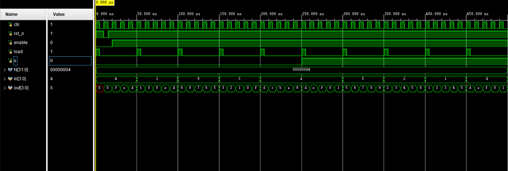

# Up_down_counter

This is the source code for coding challenge submitted by Yuqi Yi. The design is a 4-bit synchronous up/down counter, with enable, asynchronous reset, and synchronous load. Additionally, a selecting signal is applied to conduct up counting or down counting. In the testbench, the function of each control signal is tested and loaded inputs are randomly assigned.

## Simulation Results

Tool: Vivado

- The clock is set to be 10ns. The negative edge-triggered reset signal is valid. Once the reset signal falls, the output is reset to 0. In each 50ns, counter loads a new input, which shows that load control is valid.
- In the simulation, for each input data, the output minus 1 in each clock cycle when s = 0(down counting); the output adds 1 in each clock cycle when s = 1. Since it is a 4-bit counter, when it's added to maximum value 1111, the output will come back to 0000. At the same time, if it reaches the minima 0000 when down counting, the counter continues with 1111.

## Hardware or Software Project Description

The most interesting project I have completed is about embedded hardware implementation of the Distributed Memory Architecture. I simulated the RTL design in QuestaSim, and conducted logic synthesis of DRRA Fabric in Innovus. The results of both flat and bottom-up synthesis were analyzied. According to the logic synthesis, I also designed the floorplan of the architecture, and created 16 partitions(also named SiLago). The physical synthesis was conducted hierarchically and the design got a good slack and a satisfying utilization rate. In this project, I have experienced a practical working flow of embedded system hardware implementation, and I found it very helpful to build up my understanding and skills.

## More Information

Github page: https://github.com/CoraYi/Coding_Challenge.git
Linkedin: https://www.linkedin.com/in/yuqi-yi-7675bb293/
